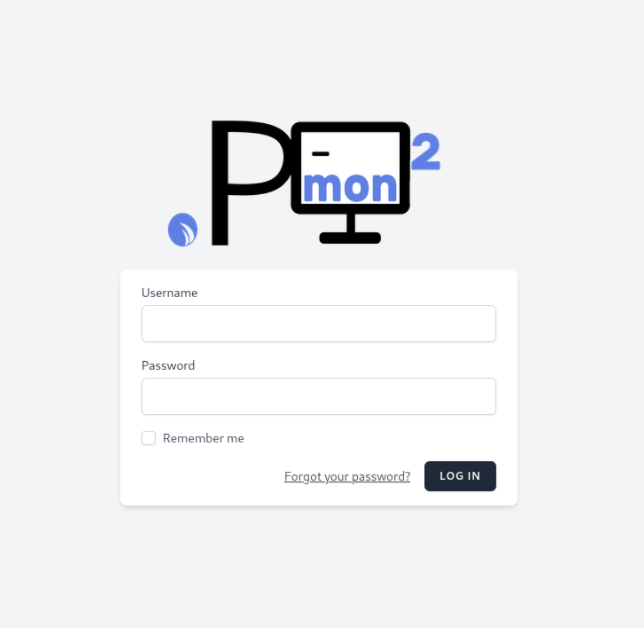

PMON2
 

PMON2 is a tool with a Web User Interface to monitor connections through pings. With PMON2 you can monitor your connections and be notified via email when any host is down. PMON2 also shows usefull information about conection state in real time. 
 
 

PMON2 has a Users and Roles system. You will be able to see information about the hosts assigned to each role. At this way PMON2 can work in a workgroup through the internet or a local network and each user will be capable to add, edit, see, etc,hosts assigned to its role.

Install dependencies:

    -Remove PHP package and install it from Odrej repo (recommended):

        apt remove php
        apt install ca-certificates apt-transport-https software-properties-common
        add-apt-repository ppa:ondrej/php
        sudo apt-get update –y
        apt install php php-curl php-xml

    -Install composer:

        curl -sS https://getcomposer.org/installer -o /tmp/composer-setup.php
        php /tmp/composer-setup.php --install-dir=/usr/local/bin --filename=composer

    -Install SQLite3:

        apt install -y sqlite3 php-sqlite3

    -Install ArpScan and NetTools
        apt install -y arp-scan net-tools
        

Installing and setting up:

    git clone https://github.com/DeHerschel/PMON2.git
    cd PMON2
    chmod +x install.sh
    sudo ./install.sh

    Go to localhost:7000 in your browser and log in with the user 'admin' and the password 'password'.

    Admin user has the superadmin role. As a superadmin, from the user's configuration page you can create new users and assign roles. Register your new user as a superadmin and remove the default 'admin' account. 

